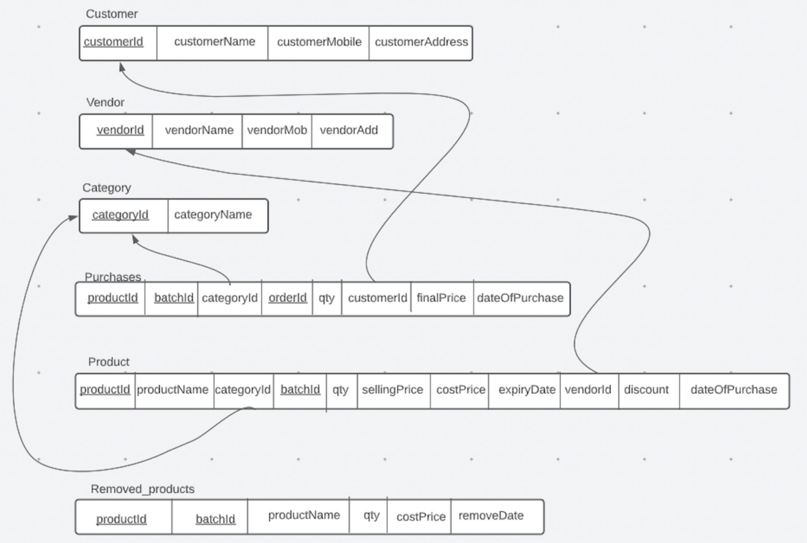
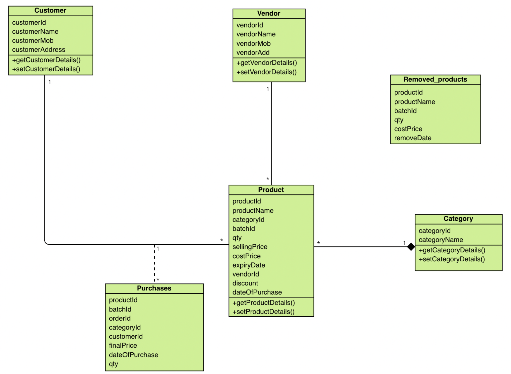

# JDBC Retail Engine - Retail Store Management System

## Overview
The **JDBC Retail Engine** project is a comprehensive retail store management system designed to facilitate various operations in a traditional store setup. This project is built using JDBC (Java Database Connectivity) and MySQL, adhering to the principles of Object-Oriented Programming (OOP).

## Project Domain
**Retail Store (Traditional Store)**

## Use Cases

### 1. List by Category
**Description (Normal Flow):** Provides a list of items in a given category displaying quantity, price, etc., which can be sorted by different attributes.  
**Actor:** Owner of the store  
**Exceptions:**  
- No item in the requested category: Prints "Category is empty"
- Category does not exist: Prints "Category does not exist"

### 2. List Sale by Category
**Description (Normal Flow):** Lists the sale from each category, sortable by quantity, price, etc.  
**Actor:** Owner of the store  
**Exceptions:**  
- No sales data: Prints "No sales yet"

### 3. List by Expiry Date
**Description (Normal Flow):** Lists items that will expire within a given number of months or lists already expired items.  
**Actor:** Owner of the store  
**Exceptions:**  
- No product expires in the given time: Prints "No products expire in given months"

### 4. Process Order
**Description (Normal Flow):** Prints the bill for products bought by the customer and updates stock data accordingly.  
**Actor:** Owner of the store  
**Exceptions:**  
- If the owner overshoots the quantity of a product in the bill by mistake: Prints "Not enough stock"
- If the product is expired: Prints "Expired products in the order"

### 5. Add Items
**Description (Normal Flow):** Adds items to inventory and updates vendor and product details.  
**Actor:** Owner of the store  
**Exceptions:**  
- If product ID and category don’t match: Prints "Enter valid data"

### 6. Remove Product
**Description (Normal Flow):** Removes items from the inventory and updates the `Removed_products` table.  
**Actor:** Owner of the store  
**Exceptions:**  
- If product ID and batch ID combination does not exist: Prints "No such product or batch ID exists"

### 7. Loss Suffered by Months
**Description (Normal Flow):** Provides the total loss suffered in the month.  
**Actor:** Owner of the store  
**Exceptions:**  
- If no loss in the given month: Prints "No loss suffered in the given months"

## Schema Diagram


## UML Class Diagram


## Installation and Setup

### Database Setup
Login to MySQL and follow these steps before running the code:

1. Navigate to the `src` folder:
    ```bash
    cd src
    ```
2. Create the database:
    ```sql
    CREATE DATABASE retaildb;
    ```
3. Source the SQL files:
    ```sql
    source db_create.sql;
    source db_insert.sql;
    source db_alter.sql;
    ```

### Code Compilation and Execution
Follow these steps to run the code on the terminal:

1. Navigate to the `src/tables` folder and compile all files:
    ```bash
    cd src/tables
    javac *.java
    ```
2. Go back to the `src` folder:
    ```bash
    cd ..
    ```
3. Open `Retail_Factory.java` and:
    - Change the password on line 16.
    - Change the JDBC driver if required on line 13.
4. Compile all files in the `src` folder:
    ```bash
    javac *.java
    ```
5. Open `Retail_Demo.java` in VSCode and select the 'Run Java' option.

## Usage
- Follow the prompts in the application to navigate through different functionalities.
- Use the appropriate use case options to manage inventory, process orders, and view reports.

## Contributing
- Fork the repository
- Create a new branch for your feature (`git checkout -b feature-name`)
- Commit your changes (`git commit -m 'Add some feature'`)
- Push to the branch (`git push origin feature-name`)
- Open a Pull Request

---
